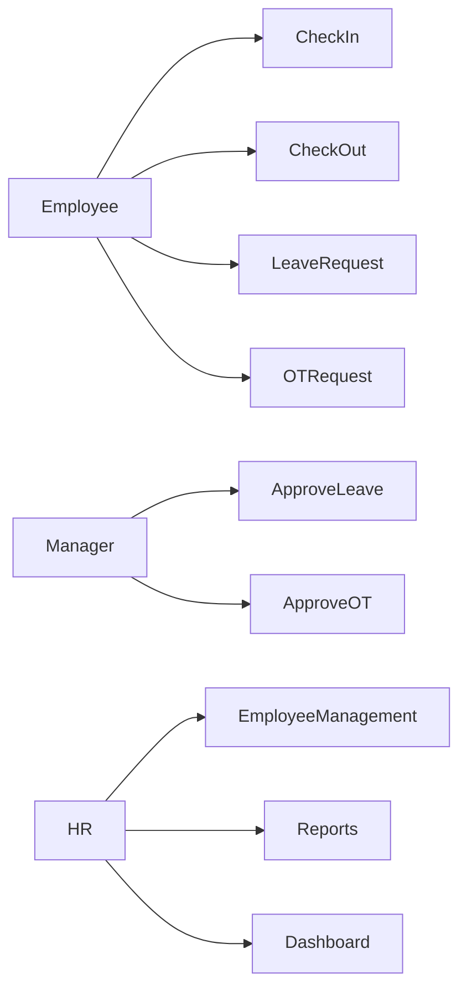
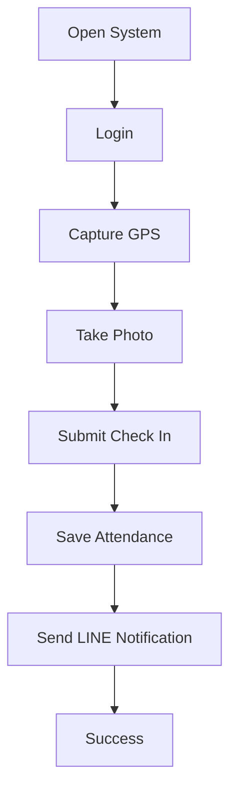
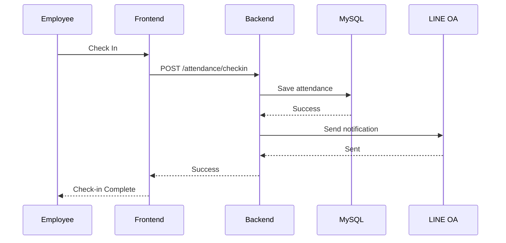
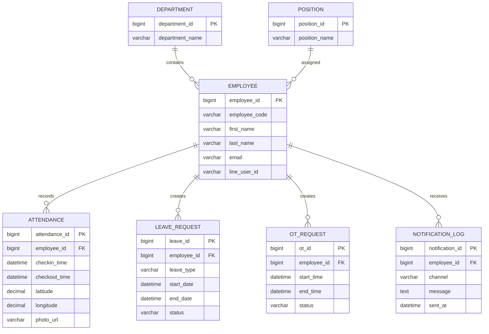
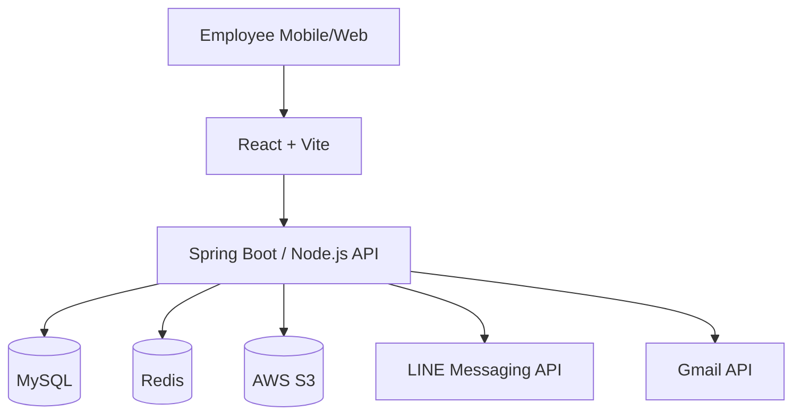

# Employee Attendance Management System
## Software Requirement Specification (SRS)

Version: 1.0

---

# 1. Introduction

## 1.1 Purpose

ระบบเช็คชื่อเข้า-ออกงานพนักงาน รองรับ LINE Login, Google Login, GPS Check-in, QR Check-in, Leave Management, OT Management และ Notification

## 1.2 Scope

- Employee Attendance
- Leave Request
- OT Request
- LINE Integration
- Gmail Integration
- Reporting & Dashboard

---

# 2. Stakeholders

| Role | Description |
|------|-------------|
| Employee | พนักงาน |
| Manager | ผู้จัดการ |
| HR | ฝ่ายบุคคล |
| Admin | ผู้ดูแลระบบ |
| Executive | ผู้บริหาร |

---

# 3. Functional Requirements

## Authentication

- FR-001 Login with Email
- FR-002 Login with Google OAuth
- FR-003 Login with LINE Login
- FR-004 JWT Authentication

## Attendance

- FR-010 Check In
- FR-011 Check Out
- FR-012 GPS Validation
- FR-013 Photo Capture
- FR-014 QR Check-in

## Leave

- FR-020 Create Leave Request
- FR-021 Approve Leave
- FR-022 Reject Leave

## OT

- FR-030 Create OT Request
- FR-031 Approve OT
- FR-032 Reject OT

---

# 4. Use Case Diagram



---

# 5. Activity Diagram - Check In



---

# 6. Sequence Diagram



---

# 7. ER Diagram



---

# 8. Architecture Diagram



---

# 9. Database Schema

## employee

```sql
CREATE TABLE employee (
 employee_id BIGINT PRIMARY KEY AUTO_INCREMENT,
 employee_code VARCHAR(50),
 first_name VARCHAR(100),
 last_name VARCHAR(100),
 email VARCHAR(255),
 line_user_id VARCHAR(255),
 department_id BIGINT,
 position_id BIGINT,
 status TINYINT,
 created_at DATETIME,
 updated_at DATETIME
);
```

## attendance

```sql
CREATE TABLE attendance (
 attendance_id BIGINT PRIMARY KEY AUTO_INCREMENT,
 employee_id BIGINT,
 attendance_date DATE,
 checkin_time DATETIME,
 checkout_time DATETIME,
 latitude DECIMAL(10,7),
 longitude DECIMAL(10,7),
 photo_url VARCHAR(500),
 working_minutes INT,
 ot_minutes INT
);
```

---

# 10. REST API

## Check In

```http
POST /api/v1/attendance/checkin
```

```json
{
  "employee_id": 1001,
  "latitude": 13.7563,
  "longitude": 100.5018,
  "photo_url": "photo.jpg"
}
```

## Check Out

```http
POST /api/v1/attendance/checkout
```

---

# 11. RBAC Permission Matrix

| Feature | Employee | Manager | HR | Admin |
|----------|----------|----------|-----|------|
| Check In | ✓ | ✓ | ✓ | ✓ |
| Check Out | ✓ | ✓ | ✓ | ✓ |
| Leave Request | ✓ | ✓ | ✓ | ✓ |
| Approve Leave | - | ✓ | ✓ | ✓ |
| Employee Management | - | - | ✓ | ✓ |
| System Settings | - | - | - | ✓ |

---

# 12. Non Functional Requirements

- HTTPS Only
- OAuth2
- JWT Authentication
- Response Time < 2 seconds
- Uptime 99.9%
- Audit Log
- Daily Backup
- รองรับผู้ใช้งานมากกว่า 10,000 คน

---

# 13. Deployment

- Frontend: Vercel / S3 + CloudFront
- Backend: ECS / EC2 / Kubernetes
- Database: MySQL RDS
- Cache: Redis
- Storage: AWS S3
- Monitoring: CloudWatch / Grafana

